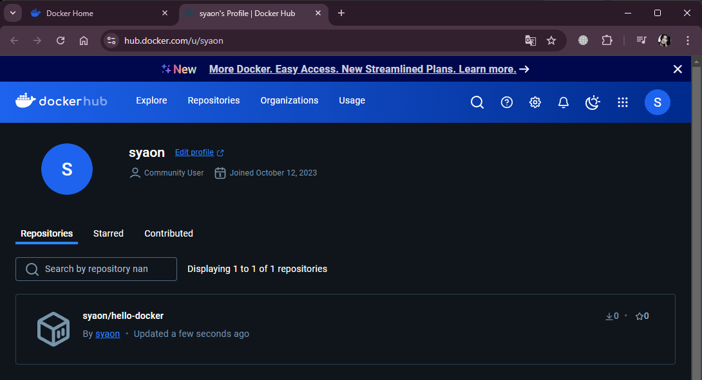

# DevOps fundamentals

## Задание 1. **Создание Docker контейнера**

- Создайте Docker контейнер с простым веб-сервером (например, на основе Nginx), который отображает "Hello, Docker!" при обращении к корневому URL.
    - Создайте файл **Dockerfile**
  
      
  
    - Создайте файл **index.html**
  
      
  
    - Постройте и запустите контейнер
  
      
  
    - Теперь, когда вы открываете браузер и переходите по адресу **http://localhost:8080**, вы должны увидеть "Hello, Docker!".
  
      
  

## Задание 2. **Передача аргументов в Docker контейнер**
- Измените предыдущий Dockerfile так, чтобы текст приветствия можно было передать в контейнер через аргументы.

  
  
  

## Задание 3. **Работа с многими контейнерами**
- Создайте файл **docker-compose.yml**, чтобы запустить одновременно два контейнера: один с веб-сервером Nginx, другой с базой данных PostgreSQL.

  
  

## Задание 4. **Передача данных между контейнерами**
- Создайте Docker контейнер с приложением на Go, которое отправляет запрос к базе данных PostgreSQL (созданной в предыдущем задании) и выводит результат.
   - Создайте Dockerfile для приложения Go
  
     
  
   - Создайте простое приложение на Go (**main.go**)
  
      
  
   - Создайте **docker-compose.yml** для обоих контейнеров
  
     
  
   - Запустите контейнеры
   - Теперь ваше приложение Go отправляет запрос к базе данных PostgreSQL, запущенной в соседнем контейнере.
  
     
  
     
  

## Задание 5. **Монтирование томов**
- Создайте контейнер с веб-сервером, в который монтируется локальный каталог (например, с HTML-страницами) внутрь контейнера.

  
  
  
  
  

## Задание 6. **Использование многоконтейнерного подхода**
- Создайте многоконтейнерное приложение, включающее веб-сервер и базу данных, каждый из которых представлен своим собственным контейнером.

  
  

## Задание 7. **Сборка образа на основе docker-compose**
- Создайте **docker-compose.yml**, который включает в себя сборку и запуск вашего приложения. 
- Создайте два контейнера и поместите их в одну и ту же сеть, чтобы они могли взаимодействовать друг с другом по именам контейнеров.
- Используйте переменные окружения в своем Dockerfile для настройки параметров приложения.

  
  
  
  

## Задание 10. **Работа с Docker Hub**
- Загрузите ваш Docker образ на Docker Hub и поделитесь им с другими.

  
  
  
  